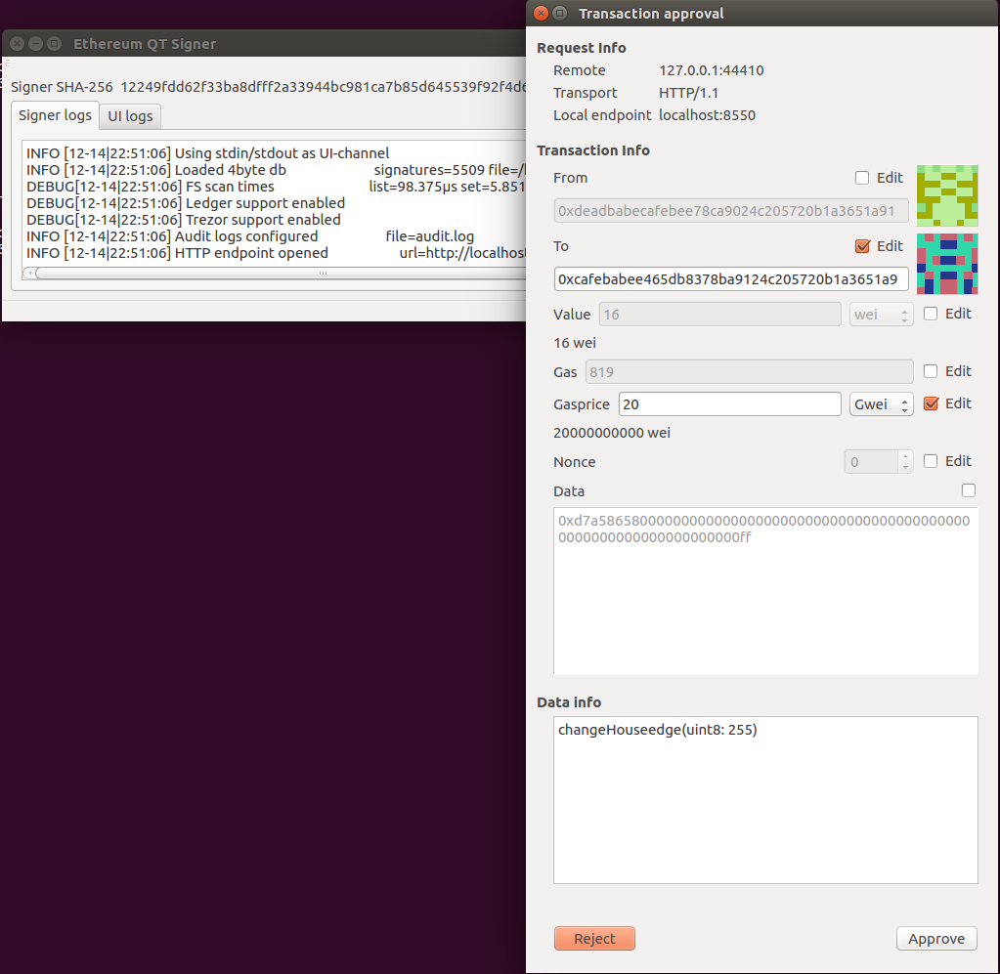
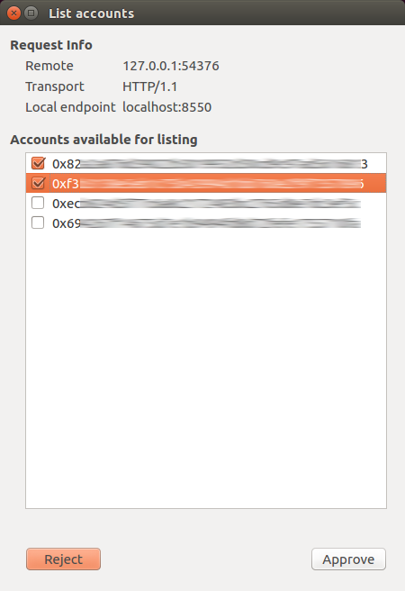

# PyQT Signer UI

This is an example implementation of a standalone UI for the geth-based signer. 

## What does it do

It starts the `signer` binary as a subprocess, and communicates with the `signer` over standard input/output. 
Whenever the `signer` needs confirmation or input from the user, it will invoke the UI. 

The UI is responsible for displaying the relevant info to the user, and letting the `signer` know if the operation is approved or not, and also the password. 

## What's the idea

The idea is to have standalone `signer` , which uses it's own trusted UI. 

The `signer` has a native command-line UI -- but that's very limited. A more advanced UI can make modifications to transactions, instead of just answering Approve/Reject. Also, people seem to favour graphical UIs over commandline UIs nowadays. 

## Current status

As of right now, this is highly untested code, more like a proof-of-concept than a finished thing. 
It currently only handles transactions, and *rejects* all other requests, such as

* Listing accounts
* Importing/exporting accounts
* Signing data
* etc... 

It currently has a systray icon, but there's not anything connected to it. 
It currently has no packaging/bundling, which should be provided as part of a proper install. 

Also, the code could be more pythonic and nice. All hands appreciated!

## Screenshots

A few screenshots: 

